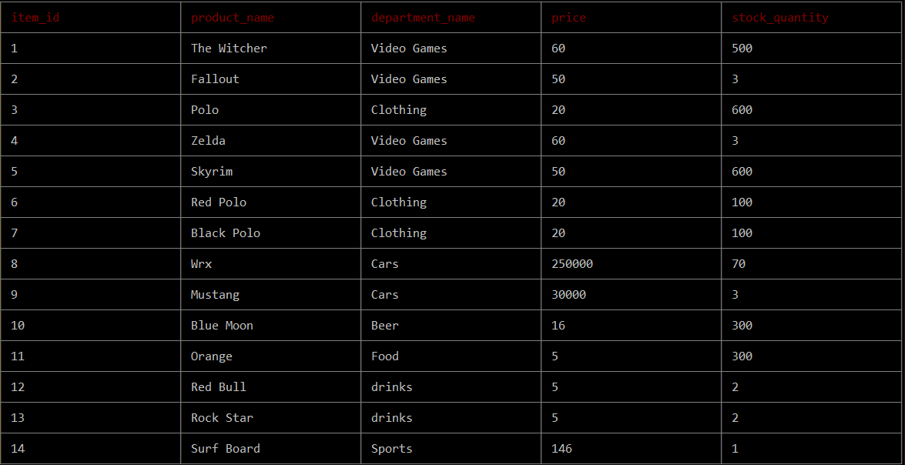

# BAMAZON

The Customer application will give him/her the option to buy from the bamazon store. A table will display which consist of an item id, product name, department name,  price and  stock quantity.

The Mangager application will have the option to view the products for sale, view products that are low in stock quantity, add a new product, and add quantity to existing products  

## Packages

* [cli-table ](https://www.npmjs.com/package/cli-table)
* [mysql](https://www.npmjs.com/package/mysql)
* [inquirer ](https://www.npmjs.com/package/inquirer)

### Prerequisites

What things you need to install the software and how to install them

```

```